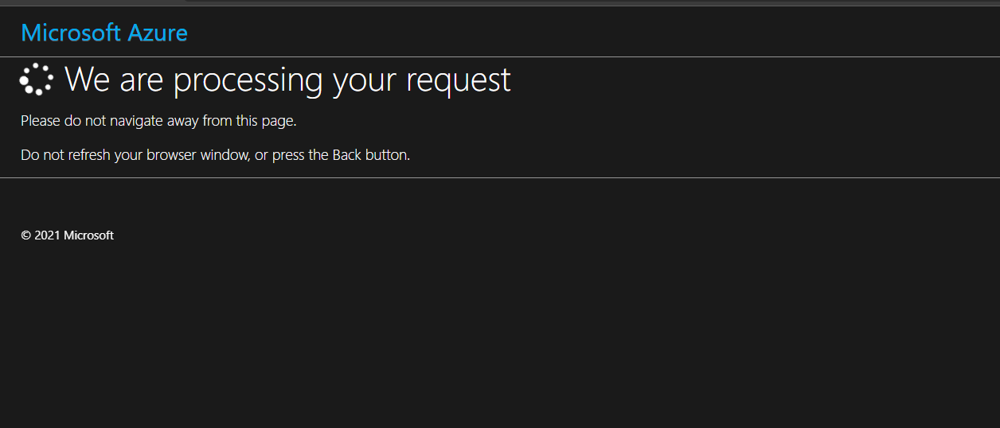
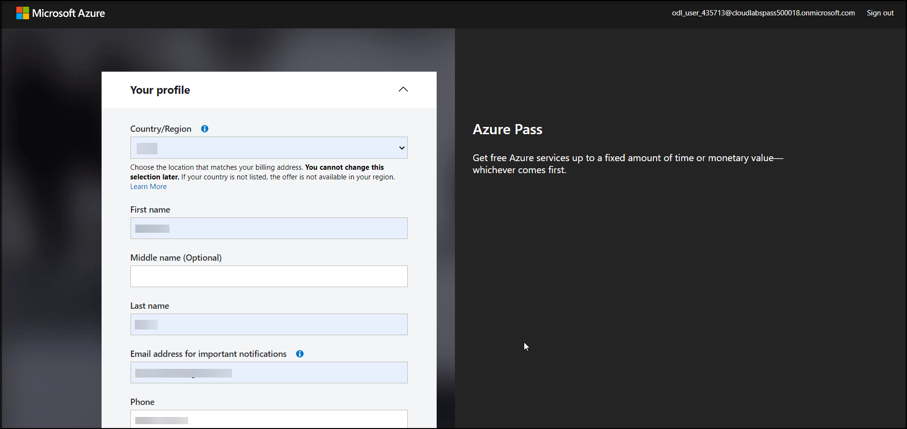
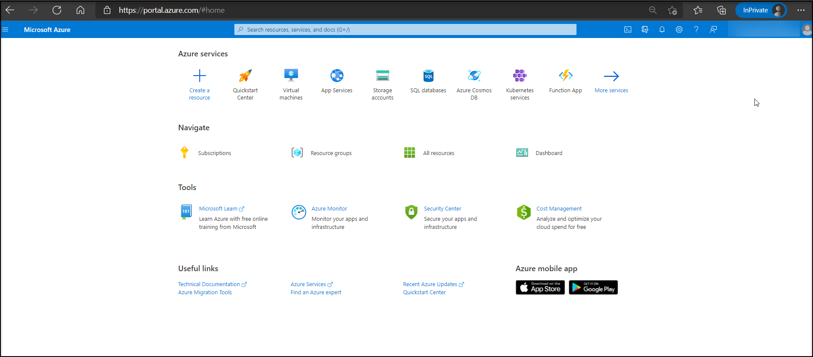

# Getting Started
## Activation of Microsoft Azure Pass Subscription

1. Click on the **Grab Azure** pass.

   
 
1. Then on the next screen, click on **here** under the **Microsoft Account Credentials** in the **Environment Details** tab.
   >**Note** : It is recommended you close all browsers and open a new In-Private Browser session.
   
   
   
1. Click the **start** button to get started.

   
 
1. Enter the **username** as provided in the **Environment Details** tab and click **Next**.

   
 
1. Provide the **Password** and click on **Sign in**.

   

1. After signing in to your Credentials provided in the **Environment Details** and click **Confirm Microsoft Account**.

   
 
1. Copy the **Azure pass** promo code provided under the **License** tab.

   
  
1. Enter the Promo Code that you Copied from Previous Step and click **Claim Promo Code**.

   
   
1. Wait until the Request get approved, This may take up to 5 minutes.

   

1. When the redemption process is completed, it will redirect to the **sign up** page. Enter your account information, **Accept** the terms and conditions ,and  click **Sign up**.
 
   
   
1. Provide the feedback on your sign up experience and click on **submit**, untill it setting up your account.

   
   
1. Select **Skip for Now** and Click on **Next**.

   
   
1. Your Azure account is Ready - Click Maybe later and Enjoy Azure Service.
  
   
   
1. Click on **Launch Lab** under the Microsoft Account Credentials in the **Environment Details** tab.

   
   
1. This should take up to 2 minutes to prepare the environment for you.
   
     

1. Use the azure credentials provided in the **Environment Details** tab.

    
   
1. you can check whether the Virtual machine is in running or stop State in the **Resource** tab.

    
    
 1. On the Next Page, Learn more about Azure resources.  
   
   
   
